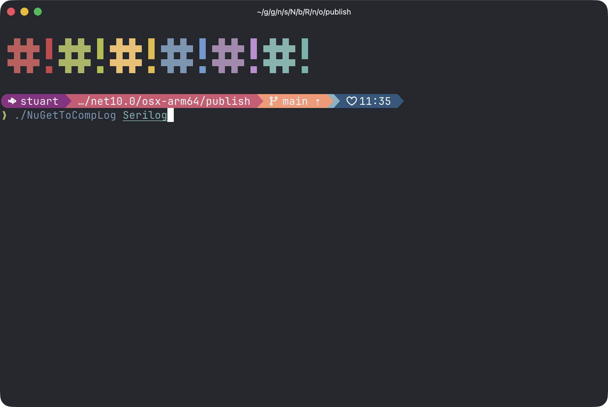

# NuGet to CompLog

A tool to extract compilation information from NuGet packages.



## What does it do?

Imagine you find an interesting NuGet package on nuget.org and want to understand exactly how it was compiled. This tool takes a package name, downloads it, and extracts all the compiler settings, references, and source information that was baked into it. The result is a **CompLog** file—a portable, self-contained snapshot containing everything needed to rebuild that package from source.

**In plain English:** It's like taking a snapshot of a build. Everything that went into compiling that package gets captured in one `.complog` file that you can move around and use to replay the original compilation.

## Example

```bash
# Download Newtonsoft.Json and extract its compilation info
dotnet run -- Newtonsoft.Json 13.0.3

# Creates: Newtonsoft.Json.13.0.3.complog
# This file now contains all compiler settings, dependencies, and sources
```

## Why would I use this?

- **Understand how packages are built** - See exact compiler flags, optimizations, and settings
- **Verify reproducibility** - Confirm you can rebuild a package identically
- **Analyze dependencies** - Inspect what each package references
- **Archive build information** - Keep a permanent snapshot of how a package was compiled
- **Security auditing** - Examine source and compilation details of dependencies

## Quick Start

```bash
# Clone and build
git clone https://github.com/username/nuget-to-complog.git
cd nuget-to-complog
dotnet build

# Extract a package's compilation info
dotnet run -- Newtonsoft.Json 13.0.3
```

This creates a `.complog` file in your current directory with all the compilation details.

## How it works

1. **Downloads the package** from nuget.org
2. **Finds the PDB files** (debug symbols with compiler information)
3. **Extracts compiler settings** like optimization flags, target framework, and references
4. **Packages everything** into a portable `.complog` file

## Important note

Not all packages include the necessary information. For a CompLog to be created successfully, the package needs to have been built with:
- Deterministic builds enabled
- Portable PDB files (not Windows PDB format)
- Embedded or available symbols

Most modern packages meet these requirements, but older packages or packages not built with SDK-style projects may not. The tool handles this gracefully—if information can't be found, it will tell you why.

## What you get

The `.complog` file contains:
- Exact compiler command-line arguments
- All referenced assemblies and their versions
- Source file paths and content
- Metadata about the build

You can then use the `complog` CLI tool to extract or replay the compilation.

## Need more details?

- **[ARCHITECTURE.md](ARCHITECTURE.md)** - Deep technical details about how the tool works
- **[PROJECT_SUMMARY.md](PROJECT_SUMMARY.md)** - Project overview
- **[CHANGELOG.md](CHANGELOG.md)** - What's changed
