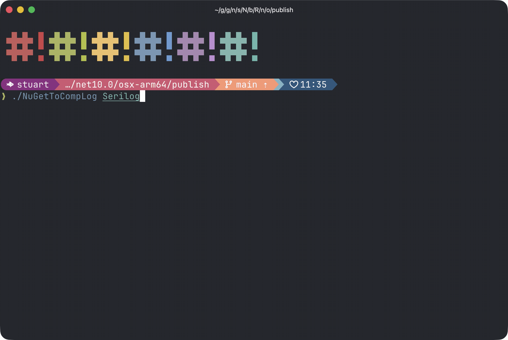

# NuGet to CompLog

A tool to extract compilation information from NuGet packages.



## What does it do?

Imagine you find an interesting NuGet package on nuget.org and want to understand exactly how it was compiled. This tool takes a package name, downloads it, and extracts all the compiler settings, references, and source information that was baked into it. The result is a **CompLog** file—a portable, self-contained snapshot containing everything needed to rebuild that package from source.

**In plain English:** It's like taking a snapshot of a build. Everything that went into compiling that package gets captured in one `.complog` file that you can move around and use to replay the original compilation.

## Install

```bash
dotnet tool install -g NuGetToCompLog
```

This installs the `nuget-to-complog` command globally. Upgrade with `dotnet tool update -g NuGetToCompLog`.

## Example

```bash
# Download Newtonsoft.Json and extract its compilation info
nuget-to-complog Newtonsoft.Json 13.0.3

# Creates: Newtonsoft.Json.13.0.3.complog
# This file now contains all compiler settings, dependencies, and sources
```

## Why would I use this?

- **Understand how packages are built** - See exact compiler flags, optimizations, and settings
- **Verify reproducibility** - Confirm you can rebuild a package identically
- **Analyze dependencies** - Inspect what each package references
- **Archive build information** - Keep a permanent snapshot of how a package was compiled
- **Security auditing** - Examine source and compilation details of dependencies

## Quick Start

```bash
# Install
dotnet tool install -g NuGetToCompLog

# Extract a package's compilation info
nuget-to-complog Newtonsoft.Json 13.0.3
```

This creates a `.complog` file in your current directory with all the compilation details.

### Verifying reproducibility

```bash
# Prove a package round-trips: rebuild it from the complog and byte-compare
nuget-to-complog verify Serilog 4.4.0
```

The `verify` command creates a complog, exports it, rebuilds with the exact compiler version
recorded in the PDB (when installed locally), and byte-compares the result against the assembly
shipped in the package. Exit codes: `0` byte-for-byte match, `2` content matches but derived
fields (MVID, timestamps, signature, PDB id) drift, `1` real differences.

To make rebuilds faithful, the tool:

- lists sources in the exact PDB Documents order (source order affects assembly bytes)
- verifies every source against the PDB checksum and repairs line-ending/BOM drift
  (Source Link serves committed bytes; the original build may have used a CRLF checkout)
- resolves reference assemblies by MVID, locating the exact targeting pack version on nuget.org
- carries Source Link and embedded sources (`/sourcelink`, `/embed`) into the complog
- reconstructs strong naming: `/publicsign` from the assembly's public key, or full signing
  when the repo commits its `.snk` (RSA signing is deterministic)

### Packages that ship more than one assembly

A working directory describes one compilation, so a package that ships several assemblies for the
same target framework (NUnit's `nunit.framework.dll` next to `nunit.framework.legacy.dll`) is
captured one at a time. The default is the assembly named after the package; `--assembly` picks
another:

```bash
# capture the sibling instead of the assembly named after the package
nuget-to-complog verify <package> <version> --assembly nunit.framework.legacy.dll
```

### Running source generators

A generated document can only be reproduced by the generator that produced it: csc embeds the
generated text itself, hashed with the generator's own checksum algorithm, so passing the same
characters as a plain file yields a different PDB and a different assembly. So the tool finds the
generator assembly the original build used and runs it — here, in this process — to prove it
regenerates those documents byte-for-byte before attaching it as `/analyzer`.

That means package-controlled code executes on your machine. It is the same exposure as building
a project that references the generator, but you only asked to read a package, so there is a
switch: `--skip-generators` (or `NUGET_TO_COMPLOG_SKIP_GENERATORS=1`) keeps generator code out of
the process. The generated documents then go in as plain source files, which the ledger records as
a substitution and which cannot reproduce the original PDB exactly.

### What the package didn't record

A NuGet package is not a self-describing build. The PDB records the compiler version, the
options blob, the references and most sources — but nothing records the analyzer set, the
source generator package versions (they are `PrivateAssets`, so the nuspec never sees them),
or flags like `/features:` and `/nowarn:`. So this tool does not *extract* a complog from a
package; it **reconstructs** one, filling those gaps by inference.

Every run writes a `{package}.{version}.reconstruction.json` next to the complog saying where
each input came from, and prints a summary:

```
Reconstruction ledger
     13  recorded     read from the package and verified
      2  derived      computed from recorded data
      1  inferred     recovered from evidence in the shipped assembly
    153  proven       searched for, then confirmed against the package
      1  substituted  knowingly not the original input
    104  missing      needed and not recovered
  ⚠ Some inputs are knowingly not the original - the rebuild will compile but cannot match:
    • source ByteString.cs: neither embedded in the PDB nor available from Source Link
    • signing /publicsign: the assembly is fully signed but no matching .snk was found ...
```

The distinctions are the point:

| | meaning |
|---|---|
| `recorded` | read from the package and verified — source bytes that hash to the PDB's checksum |
| `derived` | computed from recorded data, like the `/pathmap` root |
| `inferred` | never stated, but implied by the shipped assembly (`/features:nullablePublicOnly`) |
| `proven` | searched for among candidates, then confirmed — a reference matched by MVID |
| `assumed` | a guess nothing could confirm. Might be right; not claimed |
| `substituted` | knowingly not the original — decompiled source, a stand-in assembly |
| `missing` | needed by the compilation and not recovered |

The last three are what stop a rebuild being a faithful replay, and the ledger's verdict says
which: `exact` (everything accounted for), `unconfirmed` (only guesses in the way), or
`impossible` (something is knowingly not the original). A complog whose ledger says `exact`
should rebuild byte-for-byte; one that says `impossible` will compile but cannot match, and
now says so before you run the build rather than after.

The file carries no timestamps or machine paths and its entries are emitted in a fixed order,
so the same package always produces the same ledger — commit one and a diff shows exactly how
reconstruction quality changed.

### Building from source

```bash
git clone https://github.com/slang25/nuget-to-complog.git
cd nuget-to-complog
dotnet build
dotnet run --project src/NuGetToCompLog -- Newtonsoft.Json 13.0.3
```

## How it works

1. **Downloads the package** from nuget.org
2. **Finds the PDB files** (debug symbols with compiler information)
3. **Extracts compiler settings** like optimization flags, target framework, and references
4. **Packages everything** into a portable `.complog` file

## Important note

Not all packages include the necessary information. For a CompLog to be created successfully, the package needs to have been built with:
- Deterministic builds enabled
- Portable PDB files (not Windows PDB format)
- Embedded or available symbols

Most modern packages meet these requirements, but older packages or packages not built with SDK-style projects may not. The tool handles this gracefully—if information can't be found, it will tell you why, and the reconstruction ledger records every gap it had to fill.

## What you get

The `.complog` file contains:
- Exact compiler command-line arguments
- All referenced assemblies and their versions
- Source file paths and content
- Metadata about the build

You can then use the `complog` CLI tool to extract or replay the compilation.

## Documentation

See the [docs](./docs) folder for detailed documentation:

- [Architecture](docs/ARCHITECTURE.md) - Deep technical details about how the tool works
- [Project Summary](docs/PROJECT_SUMMARY.md) - Project overview
- [Changelog](docs/CHANGELOG.md) - What's changed
- [Quick Start Guide](docs/guides/QUICKSTART.md) - Get started in 3 minutes
- [Examples](docs/guides/EXAMPLES.md) - Usage examples
