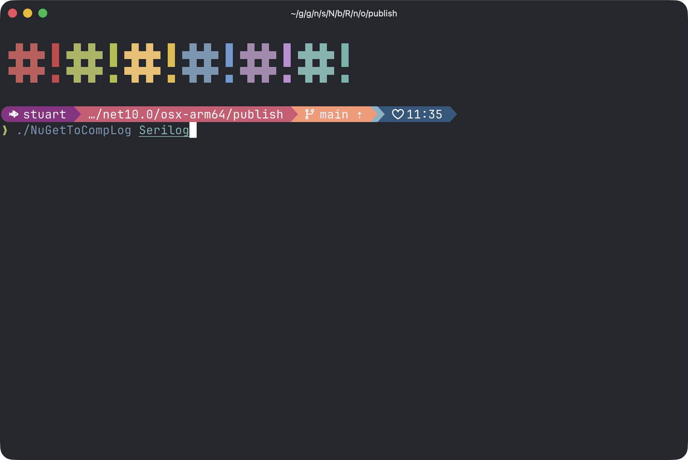

# NuGet to CompLog

A tool to extract compilation information from NuGet packages.



## What does it do?

Imagine you find an interesting NuGet package on nuget.org and want to understand exactly how it was compiled. This tool takes a package name, downloads it, and extracts all the compiler settings, references, and source information that was baked into it. The result is a **CompLog** file - a portable, self-contained snapshot containing everything needed to rebuild that package from source.

## Quick Start

```bash
# Clone and build
git clone https://github.com/username/nuget-to-complog.git
cd nuget-to-complog
dotnet build

# Extract a package's compilation info
dotnet run -- Newtonsoft.Json 13.0.3
```

This creates a `.complog` file in your current directory with all the compilation details.

## Why use this?

- **Understand how packages are built** - See exact compiler flags, optimizations, and settings
- **Verify reproducibility** - Confirm you can rebuild a package identically
- **Analyze dependencies** - Inspect what each package references
- **Archive build information** - Keep a permanent snapshot of how a package was compiled
- **Security auditing** - Examine source and compilation details of dependencies

## Documentation

### Guides

- [Quick Start](guides/QUICKSTART.md) - Get up and running in 3 minutes
- [Examples](guides/EXAMPLES.md) - Real-world usage examples
- [Testing](guides/TESTING.md) - How to test with custom packages
- [IL Verification Guide](guides/IL_VERIFICATION_GUIDE.md) - Verifying IL/assembly correctness

### Technical Reference

- [Architecture](ARCHITECTURE.md) - Technical deep dive into the system design
- [Project Summary](PROJECT_SUMMARY.md) - High-level project overview
- [Changelog](CHANGELOG.md) - Version history and changes

### Investigation & Analysis

Technical investigations conducted during development:

- [Compiler Flags Analysis](investigation/COMPILER_FLAGS_ANALYSIS.md)
- [Compiler Flags Implementation](investigation/COMPILER_FLAGS_IMPLEMENTATION.md)
- [Investigation Summary](investigation/INVESTIGATION_SUMMARY.md)
- [Round Trip Analysis](investigation/ROUND_TRIP_ANALYSIS.md)
- [Round Trip Summary](investigation/ROUND_TRIP_SUMMARY.md)
- [Round Trip Testing](investigation/ROUND_TRIP_TESTING.md)
- [Size Investigation](investigation/SIZE_INVESTIGATION.md)
- [Size Difference Analysis](investigation/SIZE_DIFFERENCE_ANALYSIS.md)
- [Serilog Investigation](investigation/SERILOG_INVESTIGATION.md)
- [Test Fix Summary](investigation/TEST_FIX_SUMMARY.md)

## How it works

1. **Downloads the package** from nuget.org
2. **Finds the PDB files** (debug symbols with compiler information)
3. **Extracts compiler settings** like optimization flags, target framework, and references
4. **Packages everything** into a portable `.complog` file

## Requirements

Not all packages include the necessary information. For a CompLog to be created successfully, the package needs:

- Deterministic builds enabled
- Portable PDB files (not Windows PDB format)
- Embedded or available symbols

Most modern packages meet these requirements, but older packages may not. The tool handles this gracefully - if information can't be found, it will tell you why.

## What you get

The `.complog` file contains:

- Exact compiler command-line arguments
- All referenced assemblies and their versions
- Source file paths and content
- Metadata about the build

You can then use the `complog` CLI tool to extract or replay the compilation.
